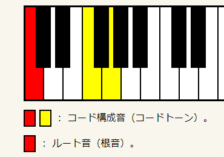

いろんな言い方してみて整理する

# dim

- Root, m3, -5
- マイナーの5度が半音下がった
- 短3度ずつ重ねたトライアド
- メジャーダイアトニックコードの7番目
  - key=C -> B, D, F
- マイナーダイアトニックコードの2番目
- [Bdim](http://music.cyberlab.info/chords/B/Bdim.html)

# aug

- Root, M3, +5
- メジャーの5度が半音上がった
- key=C -> C, E, G#
- [Caug](http://music.cyberlab.info/chords/C/Caug.html)

# sus4

- Root, P4, P5
- メジャーの3度が半音上がった
- key=C -> C, F, G
- [Csus4](http://music.cyberlab.info/chords/C/Csus4.html)

